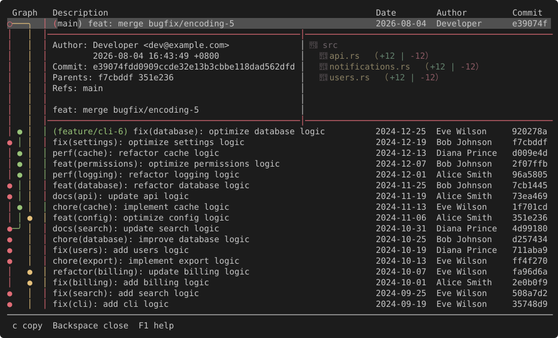
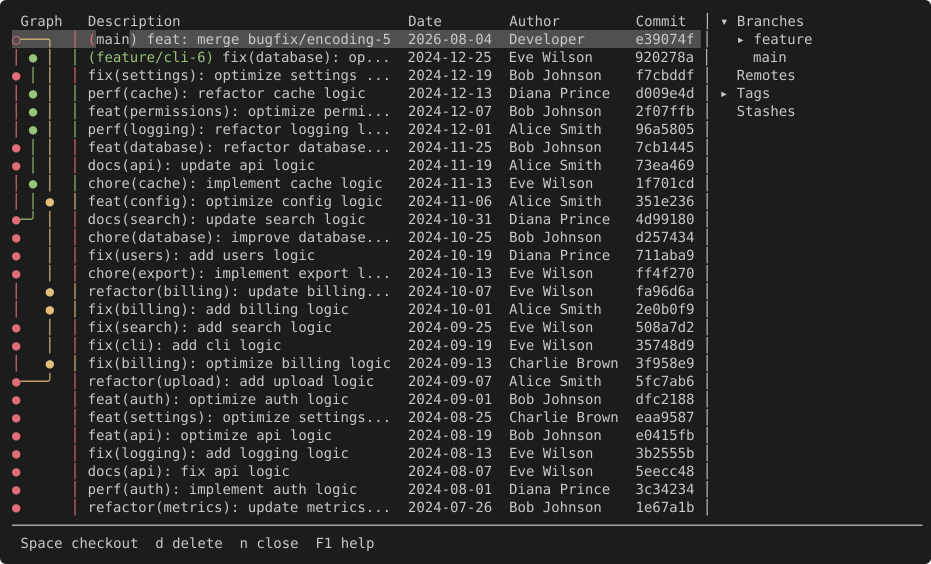
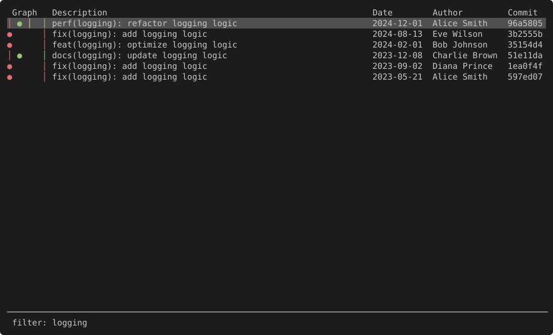

# Serie-ys

> 這是 [lusingander/serie](https://github.com/lusingander/serie) 的 fork，新增了額外功能。

[](https://ratatui.rs)

在終端機中呈現豐富的 git commit 圖，如同魔法般 📚


（畫面由 `scripts/capture_screenshots.py` 從實際執行中的 `ysgit` 擷取）

## 關於

Serie（[`/zéːriə/`](docs/src/faq/index.md)）是一個 TUI 應用程式，用 Unicode 製表字元渲染 commit 圖，效果類似 `git log --graph --all`。

## Fork 新增功能

以下功能為此 fork 新增，原版 serie 不包含：

- **GitHub Issue/PR 瀏覽器** — 按 `g` 開啟，瀏覽與篩選 issue／PR、切換 checkbox、三階段確認 merge PR、開關 issue/PR 狀態、複製連結或在瀏覽器開啟
- **Tag 管理** — 按 `t` 建立 tag，`Ctrl-t` 刪除 tag，支援推送到 remote
- **Remote refs 切換** — 按 `o` 顯示/隱藏 remote-only 的 commit，使用 BFS filtered graph 重新計算佈局
- **Ref 刪除** — 在 refs 列表中刪除 branch（local/remote）或 tag
- **篩選 (Filter)** — 按 `'` 篩選 commit 列表（`f` 是 fetch）
- **緊湊模式 (Compact)** — `-c` 讓 commit 文字貼齊該列圖形實際延伸的位置，依終端機寬度自動判斷要不要開
- **互動式設定精靈** — 在真的終端機下執行 `-h`/`--help` 會跳出互動選單，方向鍵/hjkl 切換每個選項的值、Enter 直接啟動，也可以先印出等效指令字串再啟動；`-p` 則是選 `[PATH]` 用的目錄瀏覽器（ranger 式單欄介面，標記出含 `.git` 的目錄），跟精靈共用同一份實作
- **狀態列快捷鍵提示** — 狀態列顯示當前視圖可用的快捷鍵
- **等待覆蓋層** — 長時間 git 操作（push/delete remote）時顯示等待提示

### 為什麼？

雖然有些使用者偏好透過 CLI 使用 Git，但他們在查看 commit 記錄時往往需要依賴 GUI 或功能豐富的 TUI。也有些人覺得 `git log --graph` 就已足夠。

就我個人而言，即使加上額外選項，`git log --graph` 的輸出仍然難以閱讀。僅僅為了查看記錄就去學習複雜的工具，似乎太過繁瑣。

### 目標

- 在終端機中提供豐富的 `git log --graph` 體驗。
- 提供以 commit 圖為核心的 Git 儲存庫瀏覽方式。

### 非目標

- 實作功能完整的 Git 客戶端。
- 建立具有複雜 UI 的 TUI 應用程式。

## 文件

如需詳細的使用方式、設定和進階功能，請參閱 [docs/](docs/src/SUMMARY.md)。

## 系統需求

- Git
- 能顯示 Unicode 製表字元（`● ◯ │ ─ ╭ ╮ ╯ ╰`）的終端機
  - 字型缺字時改用 `-s angular`（直角，字型涵蓋率較高）或 `-s ascii`（純 ASCII）。
  - 詳情請參閱[相容性](docs/src/getting-started/compatibility.md)。

## 安裝

從 [releases](https://github.com/YSzEthan/serie-ys/releases) 下載預先編譯好的執行檔（macOS arm64／x64、Linux、Windows，附 `checksum.txt`），或用 Rust toolchain 自行安裝：

```
$ cargo install --git https://github.com/YSzEthan/serie-ys.git
```

也可以從原版 crates.io 安裝（不含 fork 新增功能，執行檔名為 `serie`）：

```
$ cargo install --locked serie
```

各平台的詳細步驟請參閱 [docs/src/getting-started/installation.md](docs/src/getting-started/installation.md)。

## 使用方式

### 基本用法

在你的 git 儲存庫目錄中執行 `ysgit`，或直接把路徑當參數傳進去：

```
$ cd <你的 git 儲存庫>
$ ysgit

$ ysgit <你的 git 儲存庫>
```

### 選項

```
ysgit - 在終端機中呈現豐富的 git commit 圖，如同魔法般 📚

用法：ysgit [OPTIONS] [PATH]

參數：
  [PATH]  git 儲存庫路徑 [預設: 當前目錄]

選項：
  -p, --path-browser              以互動式目錄瀏覽器選擇 [PATH]（類似 ranger；可搭配路徑引數指定起始目錄）
  -n, --max-count <NUMBER>        渲染的最大 commit 數量
  -o, --order <TYPE>              Commit 排序演算法 [預設: chrono] [可選值: chrono, topo]
  -g, --graph-width <TYPE>        Commit 圖形的儲存格寬度 [預設: auto] [可選值: auto, double, single]
  -c, --compact <TYPE>            緊湊模式：commit 文字貼齊該列圖形實際畫到的最右邊 [預設: auto] [可選值: auto, on, off]
  -s, --graph-style <TYPE>        Commit 圖形的邊線風格 [預設: rounded] [可選值: rounded, angular, ascii]
  -i, --initial-selection <TYPE>  初始選取的 commit [預設: latest] [可選值: latest, head]
  -h, --help                      顯示說明
  -V, --version                   顯示版本
```

> 此 fork 的執行檔名為 `ysgit`（見 `Cargo.toml` 的 `[[bin]]`），不是上游的 `serie`。

各選項的詳細說明請參閱[命令列選項](docs/src/getting-started/command-line-options.md)。

### 快捷鍵

按 `?` 鍵即可查看快捷鍵列表。

[預設快捷鍵](docs/src/keybindings/index.md)可以自訂覆蓋。詳情請參閱[自訂快捷鍵](docs/src/keybindings/custom-keybindings.md)。

### 設定

設定檔按以下優先順序載入：

- `$SERIE_CONFIG_FILE`
  - 若已設定 `$SERIE_CONFIG_FILE` 但檔案不存在，將會產生錯誤。
- `$XDG_CONFIG_HOME/serie/config.toml`
  - 若未設定 `$XDG_CONFIG_HOME`，則使用 `~/.config/`。

若設定檔不存在，所有項目將使用預設值。
若設定檔存在但部分項目未設定，未設定的項目將使用預設值。

設定檔格式的詳細資訊請參閱[設定檔格式](docs/src/configurations/config-file-format.md)。

舊設定檔若還留著 `core.option.protocol`、`graph.row_image_width` 這類已隨圖片渲染路徑移除的鍵，會是「schema 擋、runtime 不擋」—— 編輯器標紅，但程式照常啟動、該鍵不生效。詳見[舊設定檔裡的死鍵](docs/src/configurations/index.md)。

### 使用者自訂指令

使用者自訂指令功能可讓你執行自訂的外部指令。
你可以在專用視圖中顯示像 `git diff` 這樣的指令輸出，在背景執行像刪除分支這樣的指令，或透過暫停應用程式來執行 `vim` 等互動式指令。

指令設定方式詳見[使用者自訂指令](docs/src/features/user-command.md)。

## 相容性

commit 圖是用一般文字繪製的，不送任何圖片跳脫序列。因此**沒有終端機白名單**：只要能畫出 Unicode 製表字元的終端機都能用。

- 字型缺 `● ◯ │ ─ ╭ ╮ ╯ ╰` 這些字時，用 `-s angular`（直角）或 `-s ascii`（`* o | - +`）。
- 終端多工器（tmux、screen、Zellij 等）**可以正常使用**。上游因為圖片協議無法穿透多工器而排除它們，這個限制在此 fork 已經不存在。
- Sixel、iTerm2 inline images、kitty graphics protocol 都不再需要，有沒有支援都不影響。

> 這是此 fork 與上游最大的行為差異，上游文件的[相容性](https://lusingander.github.io/serie/getting-started/compatibility.html)一節不適用於這裡。

## 截圖

Commit 詳情（`Enter`）：



Refs 清單（`Tab`）—— 此 fork 可以在這裡刪除 branch 與 tag：



篩選（`'`）—— 此 fork 新增，會用 BFS 重算 filtered graph 的佈局：



這些不是螢幕截圖，是從執行中的 `ysgit` 擷取出來的 SVG。作法與重跑方式見[截圖](docs/src/features/screenshots.md)。

## 貢獻

如需開始貢獻，請先閱讀 [CONTRIBUTING.md](CONTRIBUTING.md)。

未遵循這些指引的貢獻可能不會被接受。

## 授權條款

MIT
