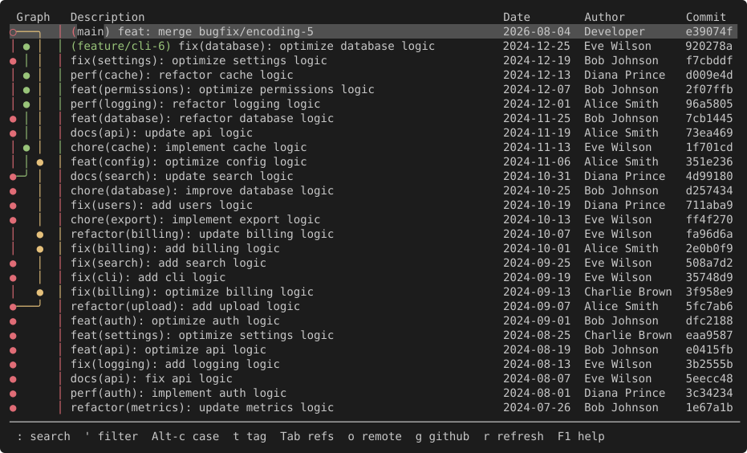

# 簡介

**Serie**（[`/zéːriə/`](../faq/index.md)）是一個 TUI 應用程式，用 Unicode 製表字元渲染 commit 圖，效果類似 `git log --graph --all`。

（畫面由 `scripts/capture_screenshots.py` 從實際執行中的 `ysgit` 擷取，更多請見[截圖](../features/screenshots.md)）

## 為什麼？

有些人平常用 CLI 操作 git，但要看 commit 記錄時還是得開 GUI 或功能齊全的 TUI。也有人覺得 `git log --graph` 就夠了。

我自己是覺得 `git log --graph` 就算加了選項還是很難讀。但為了看個記錄去學一套複雜的工具，又太麻煩。

## 目標

- 在終端機中提供豐富的 `git log --graph` 體驗。
- 提供以 commit 圖為核心的 Git 儲存庫瀏覽方式。

## 非目標

- 實作功能完整的 Git 客戶端。
- 建立具有複雜 UI 的 TUI 應用程式。

---

_以 Rust 與 [ratatui](https://github.com/ratatui/ratatui) 打造。_  
_Serie 以 MIT 授權條款發布於 [GitHub](https://github.com/lusingander/serie)。_
